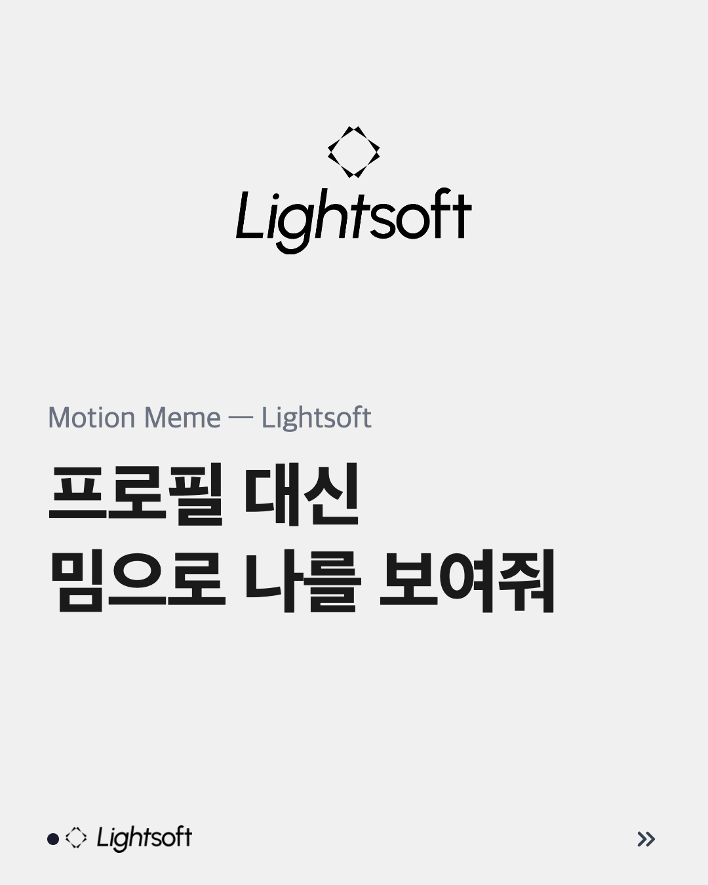
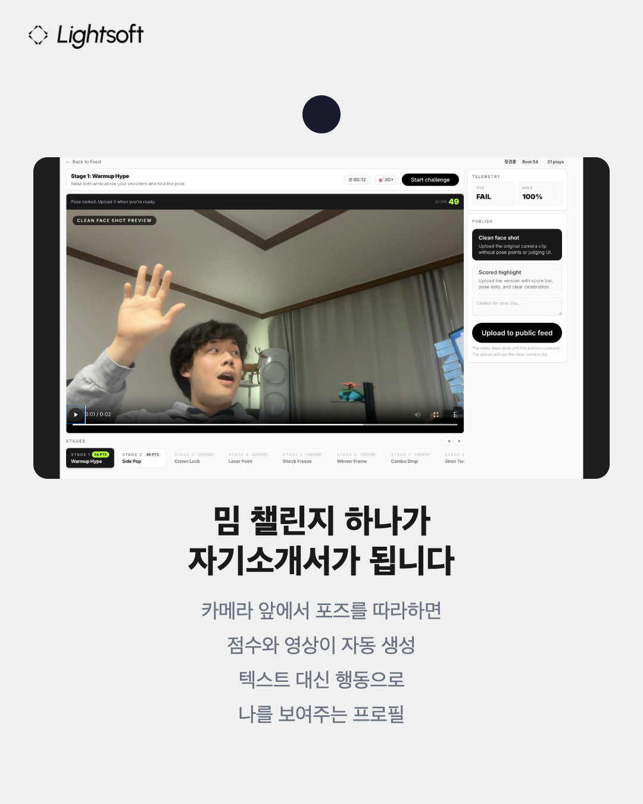
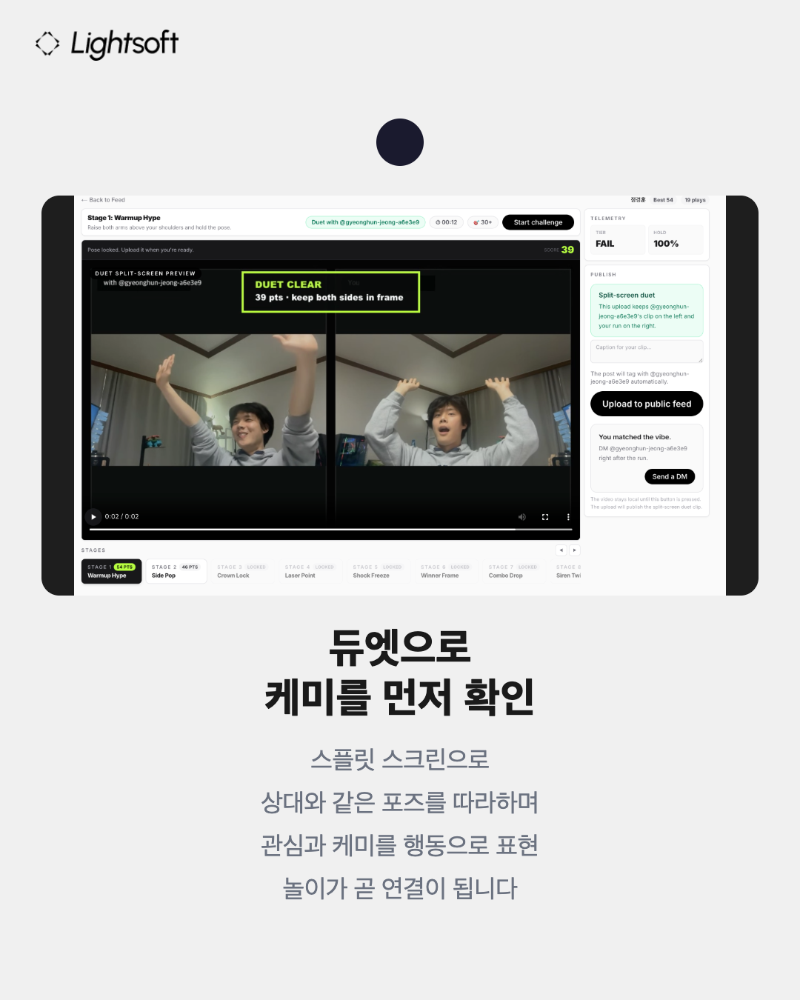
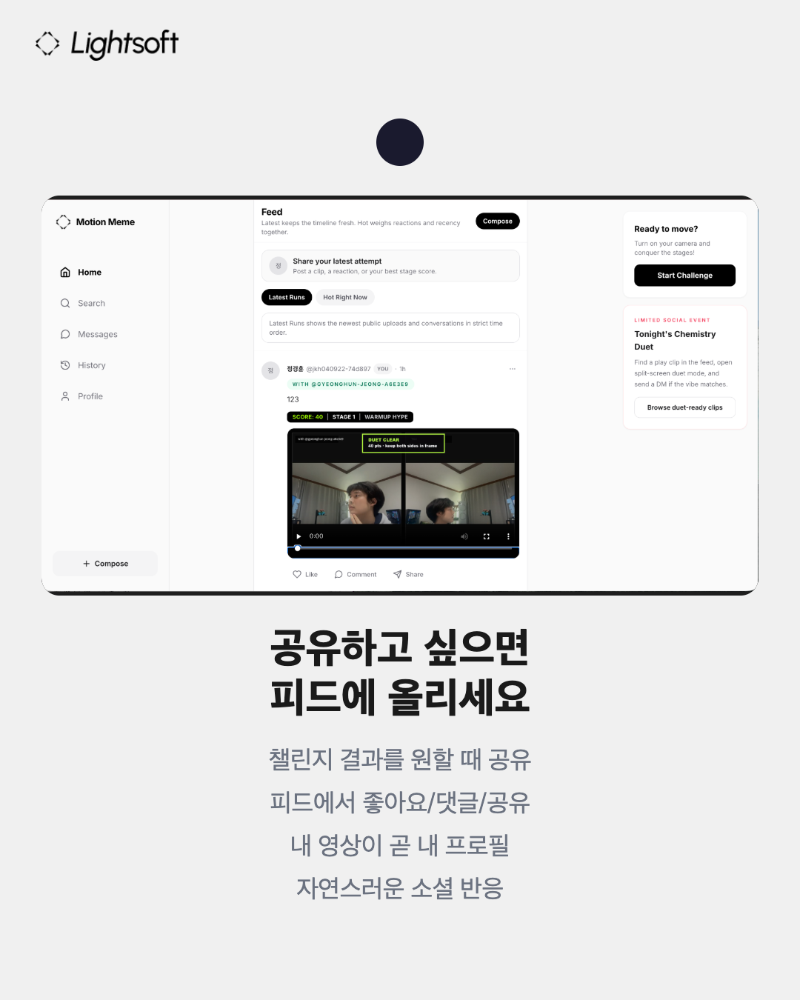
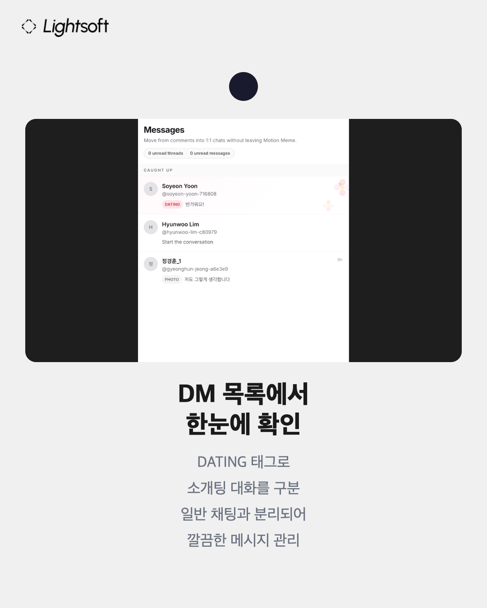
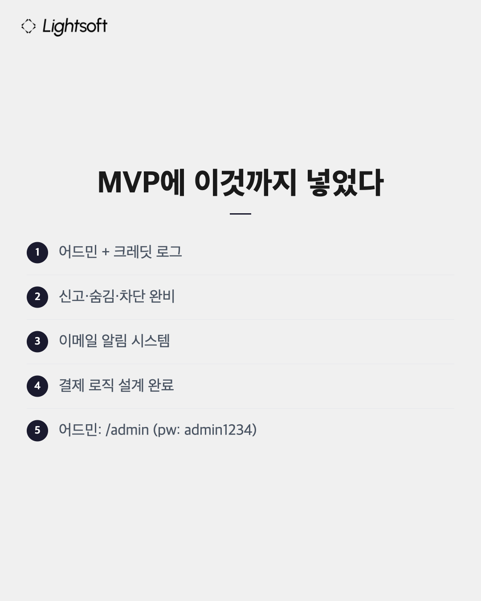
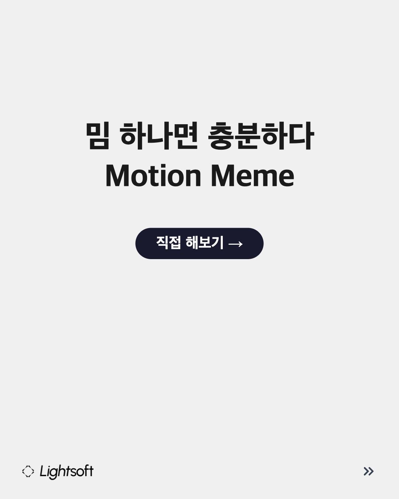

# Motion Meme

프로필 대신 밈으로 나를 보여주는 행동 기반 소셜 플랫폼.

Motion Meme는 짧은 카메라 챌린지 한 번으로 자기소개, 콘텐츠 업로드, DM, 소개팅 인트로, 광고 제안까지 이어지게 만드는 웹 기반 MVP입니다. 텍스트 프로필을 길게 꾸미는 대신, 챌린지 결과 영상 하나로 나를 표현하고 연결될 수 있게 만드는 것이 핵심입니다.

## 왜 만들었나

- 위시켓, Threads, 숨고처럼 "나를 보여주고 연결되는" 플랫폼 수요는 크지만, 실제 사용자는 프로필 정리, 글 작성, 포트폴리오 구성 같은 준비 비용이 큽니다.
- 소개팅 앱도 사진, 소개글, 설정 입력 등 진입 장벽이 높습니다.
- Motion Meme는 이 과정을 `짧은 밈 챌린지 + 결과 영상`으로 대체해서, 더 빠르게 나를 드러내고 상대와 연결될 수 있게 만듭니다.

## 제품 방향

### 1. 개인형 블로그 / 개인 브랜딩

- 광고 수익이 가능한 개인형 페이지의 대안으로 접근했습니다.
- 사용자는 글과 포트폴리오를 길게 정리하지 않아도, 챌린지 결과 영상으로 자신을 어필할 수 있습니다.
- 광고주나 협업 파트너는 프로필보다 먼저 "반응"과 "캐릭터"를 보고 DM을 보낼 수 있습니다.
- 플랫폼은 중간에 크레딧 체계를 두어 `Brand / collab` 같은 intent-based 접근을 유료화할 수 있습니다.

### 2. 소개팅 앱

- 소개팅의 본질은 결국 "상대에게 접근하고 연결되는 것"에 있습니다.
- Motion Meme는 듀엣 챌린지와 결과 영상을 통해 외모/글보다 `행동`, `분위기`, `리액션`으로 먼저 자신을 보여주는 구조를 만듭니다.
- `Dating intro` 같은 special DM을 통해 일반 메시지와 구분되는 접근을 만들고, 크레딧을 통해 진지한 의도를 필터링합니다.
- 초기 사용자 풀 부족 문제는 운영자가 관리 가능한 회원 데이터와 어드민 도구로 보완할 수 있게 설계했습니다.

## 핵심 차별점

- 챌린지 1회가 곧 자기소개
- 재미 -> 업로드 -> 피드 노출 -> DM -> 제안/소개 요청으로 이어지는 단일 루프
- 일반 DM, 소개팅 인트로, 광고 제안을 하나의 채팅 구조 안에서 intent로 구분
- 앱 설치 없이 웹에서 바로 시작
- DM/댓글/리마인드 이메일로 웹 서비스의 재방문 약점을 보완

## 주요 기능

- Google 로그인
- 10단계 이상 스테이지형 챌린지
- 포즈 유사도 기반 점수
- 결과 영상 업로드
- 공개 피드
- 글 / 이미지 / 플레이 영상 게시
- 댓글 / 좋아요 / 팔로우
- 1:1 DM / Dating intro / Brand collab intent
- 크레딧 잔액 / 사용 로그
- 듀엣 플레이
- 신고 / 숨김 / 차단
- `/admin` 운영 대시보드

## 스크린샷

### 컨셉



### 챌린지로 자기소개



### 업로드와 피드



### 듀엣 플레이와 연결



### 소개팅 / 광고 제안 intent



### 운영 / 어드민 관점



### MVP 정리



## 기술 스택

- Next.js 14 App Router
- React 18
- TypeScript
- Tailwind CSS
- Framer Motion
- Supabase
- Resend
- MediaPipe Pose Landmarker

## 현재 구현 범위

- 피드 / 검색 / 프로필 / 플레이 / 히스토리 / DM / 어드민 연결
- `meme` 스키마 기준 실제 DB 반영
- special DM intent + credits + admin dashboard
- 이메일 테스트 하네스 `/test/email`

## 로컬 실행

```bash
npm install
npm run dev
```

기본 주요 경로:

- `/feed`
- `/play`
- `/messages`
- `/profile/[handle]`
- `/admin`
- `/test/email`

## 어드민

- 경로: `/admin`
- 비밀번호: `admin1234`

현재 가능한 운영 기능:

- 회원 목록 확인
- 크레딧 지급
- special DM 요청 상태 변경
- reported posts 확인
- credit ledger 확인

## 테스트용 메모

- 결제는 아직 미구현이며, 현재 크레딧 구매는 mock purchase 로직만 연결되어 있습니다.
- 이메일은 Resend 기반으로 실제 발송됩니다.
- 테스트용 회원 계정 및 데이터가 포함되어 있습니다.

## 참고 문구

프로필 꾸미는 시간, 이제 절대 낭비하지 마세요.

밈 챌린지 1번으로 자기소개 + 포트폴리오 + 광고 제안까지 한 번에. 글도 사진도 필요 없이 "반응"으로 나를 보여주는 행동 기반 프로필의 시대를 목표로 만든 프로젝트입니다.
